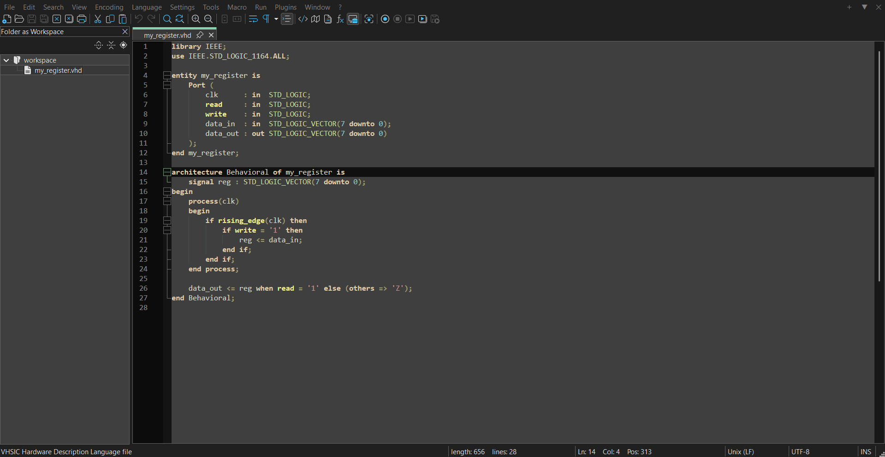
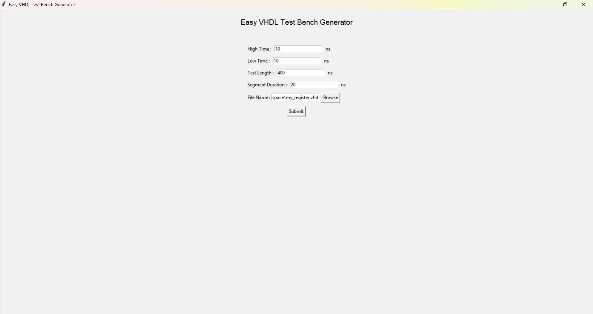
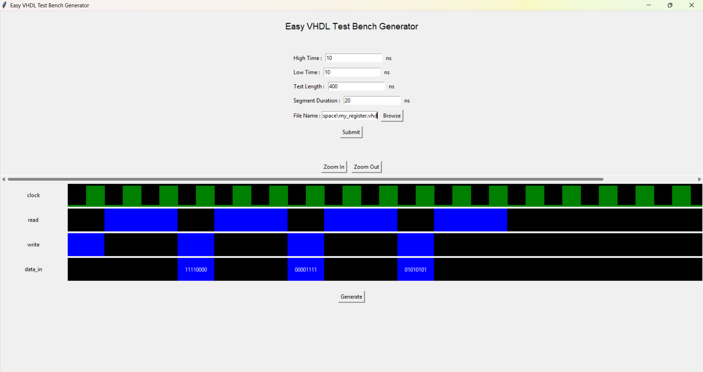
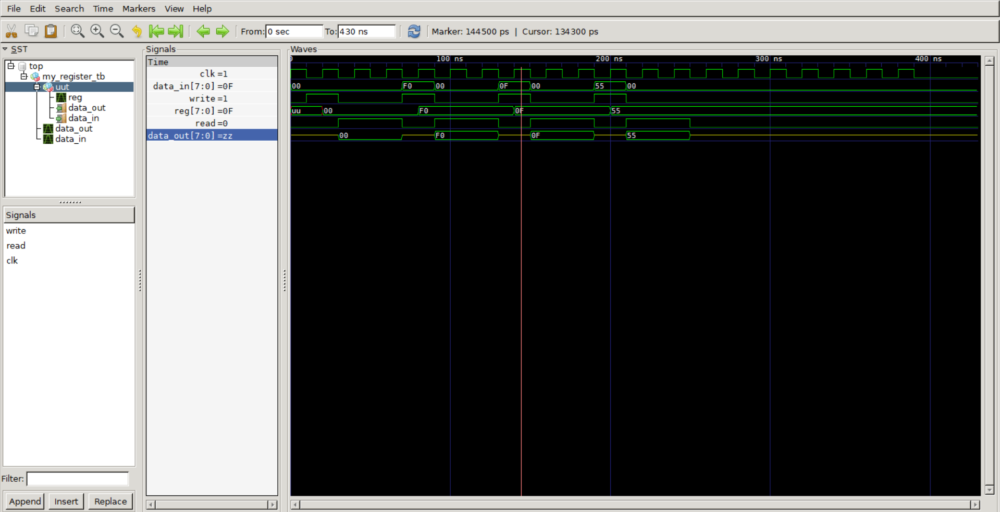
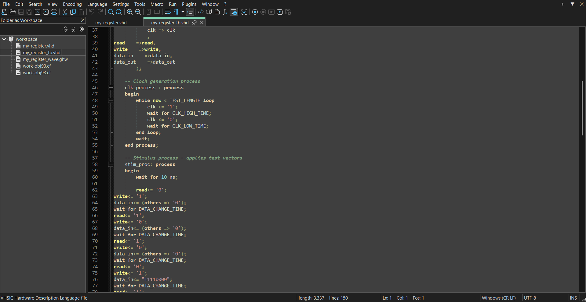

# easyVHDL

**easyVHDL** is a portable VHDL editor and simulator designed to help beginners learn VHDL using open-source tools. It bundles Notepad++, GHDL, GTKWave, and VVTG into a single folder with a preconfigured workspace, allowing users to start editing and simulating VHDL code instantly — no installation required.

---

## 📁 File Structure

<strong>📁 easyVHDL/</strong>

<strong>📄 start.bat</strong>

Launches Notepad++ with a predefined session and workspace.

<strong>📁 notepadpp/</strong>

<strong>📄 notepad++.exe</strong>

Portable Notepad++ executable.

<strong>📁 simulator/</strong>

<strong>📄 VVTG.exe</strong>

Visual VHDL Testbench Generator.

<strong>📁 ghdl/</strong>

Contains GHDL binaries and libraries.

<strong>📁 gtkwave/</strong>

Contains GTKWave waveform viewer.

<strong>📁 workspace/</strong>

<strong>📄 my_register.vhd</strong>

Default VHDL file to start editing.

 <!-- workspace -->

 <!-- simulator -->

 <!-- notepadpp -->

 <!-- easyVHDL -->

---

## 🚀 Getting Started

> 🔴 **WARNING**: VVTG will face errors if your VHDL file has comments in some places so when in doubt why your design is not working make sure to remove comments.

1. Run `start.bat` to launch Notepad++ with the default workspace.

2. Edit `my_register.vhd` or create a new VHDL file or open a new worspace.
3. Press F9 to open VVTG.

4. Edit the wave how you like.

5. Generate and view (signals might not open so select them from the left panel and open them, zoom fit your signals).

> ⚠️ **Note on VVTG**: Currently, only std_logic and std_logic_vector signal types are supported for simulation and waveform visualization.
---

## 🛠️ Included Tools & Licenses

This package includes the following open-source tools:

| Tool         | License | Source |
|--------------|---------|--------|
| [GHDL](https://github.com/ghdl/ghdl) | GNU GPL v2 | by Tristan Gingold |
| [GTKWave](http://gtkwave.sourceforge.net/) | GNU GPL v2 | GTKWave Team |
| [Notepad++](https://notepad-plus-plus.org/) | GNU GPL v3 | Notepad++ Team |
| [VVTG](https://github.com/abofgames/VVTG) | Custom License | by me |

All tools are redistributed under their respective licenses. See the `LICENSES/` folder for full license texts and attribution details.

> ⚠️ **Note on GHDL**: Executables produced by GHDL may not be redistributed without also providing access to the original VHDL source files, per GHDL’s runtime licensing terms.

---

## 📚 Learn More

- [GHDL Documentation](https://ghdl.github.io/ghdl/)
- [GTKWave Manual](http://gtkwave.sourceforge.net/)
- [Notepad++ User Guide](https://npp-user-manual.org/)
- [VVTG GitHub Repo](https://github.com/abofgames/VVTG)

---

## 🤝 Credits

Special thanks to the developers and contributors of the included tools. This project is built on their incredible work.

---

